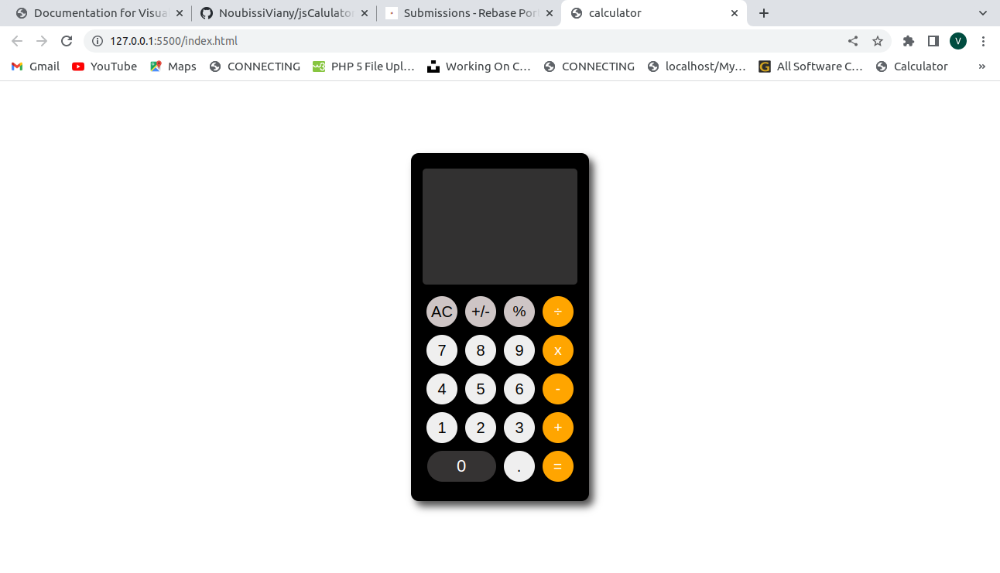

# Js Calculator project

this project is all about International Network.

## App

### Built With

- HTML
- CSS
- JS

### Prerequisites

Knowledge about:

- HTML
- CSS
- JS
- Google chrome

## Clone project

- To get a local copy up and running follow these simple example steps.
- Clone this repository with `git@github.com:NoubissiViany/jsCalculator-Project.git` using your terminal.
- Change to the project directory by entering: cd Food-Template in the terminal.

## steps

- $ git clone `git@github.com:NoubissiViany/jsCalculator-Project.git`
- $ `cd Calculator-Project`
- $ `git checkout feature/body`

## Start App

- run by opening the index.html in the browser

## Author

👤 **NoubissiViany**

- GitHub: [NoubissiVinay](https://github.com/NoubissiViany/jsCalculator-Project)

## 🤝 Contributing

Contributions, issues, and feature requests are welcome!

Feel free to check the [issues page](https://github.com/NoubissiViany/jsCalculator-Project/issues).

## 📝 License

This project is [Rebase](./LICENSE) licensed.
